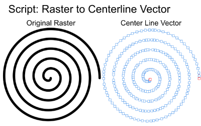

# Affinity-Centerline-Tracer-Script

Convert raster line art into centerline vector paths in Affinity.

This script performs:

* Binarization
* Zhang-Suen thinning
* Skeleton tracing
* Junction correction
* Spur removal
* Collinear path merging
* RDP path simplification

## Requirements

* Affinity with scripting support
* Cowork
* Claude Desktop / Claude Code
* Affinity MCP connection

## Installation

1. Download `centerline-tracer-v4.0.js`

2. Start Cowork

3. Connect Affinity through MCP

4. Ask Claude:

   "Register this JS file in the Affinity Script Library as 'Centerline Tracer v4.0'"

5. The script will become available from the Affinity Scripts panel.

## Usage

1. Select a raster image in Affinity.
2. Run **Centerline Tracer v4.0**.
3. Adjust parameters as needed:

### Basic

* White Foreground (INVERT)

### Cleanup

* Minimum Path Length
* Spur Removal Length

### Output

* Simplification Precision
* Stroke Width

4. Click OK.

The script generates centerline vector paths from the selected raster image.

## Version History

### v4.0

Added adjustable parameters through a dialog:

* Minimum Path Length
* Spur Removal Length
* Simplification Precision
* Stroke Width

### v3.9.1

Fixed coordinate conversion using spread coordinates.

### v3.9

Implemented geometric junction recalculation using least-squares intersection.

## Developed With

Created using Claude Code and Affinity MCP.

## License

MIT
